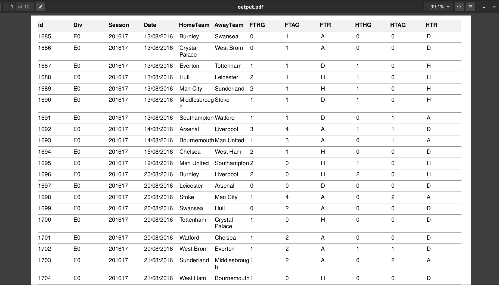

# Leaguey

## The Ultimate Match Score API.


>**Leaguey** allows you to do the following

- [x] Fetch Historical Match Results.
- [x] Granulated Fetch based on Season and Division.
- [x] Generation of PDF of Results using query parameter `format=pdf`.
- [x] Store PDF for up to two days in the cloud.
- [x] Documentation with [OpenAPI](https://leaguey.herokuapp.com/swagger-html) (https://leaguey.herokuapp.com/swagger-html).

**Note**: **I have a deployed version of the aplication found [here on Heroku](https://leaguey.herokuapp.com/swagger-html)**

## Images
<details>
<summary>Here are samples.</summary>



</details>

## Built With

- [Nodejs](https://nodejs.org/en/)
- [TypeScript](https://www.typescriptlang.org/)
- [Koa](https://koajs.com/)
- [TypeORM](https://www.mongodb.com/)
- [MySQL](https://www.mysql.com/)

## Getting Started
This application can be deployed locally by the following ways.
- Using `docker-compose`
- Using `Docker`
- Using the local environment.

### Prerequisites
If you are considering the first two options of deployment, you would need to have a local installation of mySQL. `docker-compose` automates the setting up of these prerequisites and is the prefered form of deployment.

### Docker-compose

You need to run the project by running.
```bash
npm run make:up
``` 
or 

```bash
docker-compose -f "docker-compose.yml" up -d --build

```

### Docker
To run the application with docker, you need a local istallation of MySQL and the `MYSQL_DATABASE` already created. After satisfying the reuirement, run the following to build the image. **Note**: `MYSQL_DATABASE` will not be created automatically and would need to be manually created.
```bash
docker build --pull --rm -f "Dockerfile" -t leaguey:latest "."
```
and this to run the image.
```bash
docker run --rm -it \
    --network="host" \
    -e MYSQL_ROOT_PASSWORD='passworD' \
    -e MYSQL_USERNAME='root' \
    -e MYSQL_DATABASE='leaguey' \
    -e MYSQL_HOST='localhost' \
    -p 3000:3000/tcp \
    leaguey:latest

```
You can also pull the image from DockerHub with:
```bash
docker run --rm -it \
    --network="host" \
    -e MYSQL_ROOT_PASSWORD='passworD' \
    -e MYSQL_USERNAME='root' \
    -e MYSQL_DATABASE='leaguey' \
    -e MYSQL_HOST='localhost' \
    -p 3000:3000/tcp \
    teezzan/leaguey:latest
```
### Local Environment

Foremost, you have to clone this repository and install all the dependencies with the following commands.
```bash
git clone https://github.com/teezzan/Leaguey.git
cd Leaguey
npm install

```
Rename the `.env.example` to `.env` and customize it to your local machines specifications.
**Note**: `MYSQL_DATABASE` will not be created automatically and would need to ba manually created.

Run `npm run make:serve` to start the local server.


### NPM scripts

- `npm run make:up`: Uses Docker-compose to spring up server
- `npm run make:test`: Run tests
- `npm run make:build`: Builds the Typescript code and deploy locally
- `npm run make:serve`: Run tests

## API Reference/Documentation
A swagger documentation can be found at `http://localhost:3000/swagger-html`
## Authors

**[Taiwo Yusuf](https://github.com/teezzan/)**